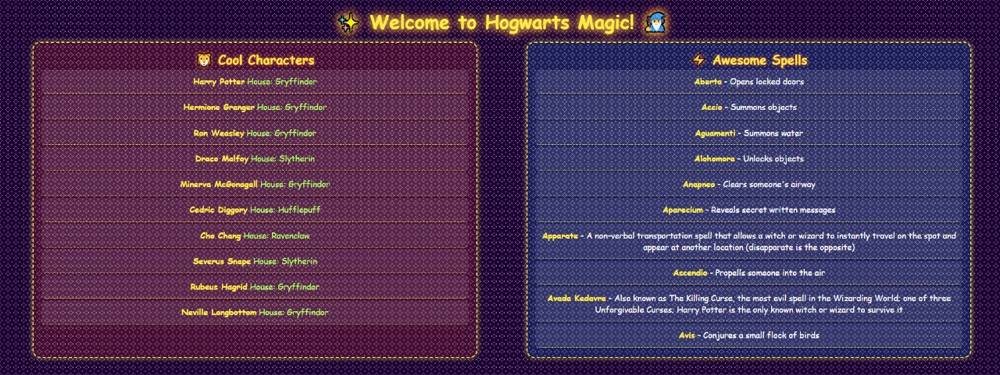

# ✨ Hogwarts Magic Adventure 🧙‍♂️

Welcome to **Hogwarts Magic Adventure**, a fun project that fetches and displays Harry Potter characters and spells using RESTful APIs. Built with **Express.js** and **EJS**, this project showcases API integration in a simple and interactive way! 🚀

## 🎭 Features
- Fetch **Harry Potter characters** with their houses
- Fetch **spells** and their descriptions
- Dynamic UI using **EJS** templating
- Styled with **CSS animations** for a magical touch ✨

## 🛠️ Tech Stack
- **Node.js** + **Express.js**
- **EJS** for templating
- **Axios** for API requests
- **HTML, CSS** for frontend

## 📸 Preview


## 🔥 Getting Started

1. Clone the repository:
   ```bash
   git clone https://github.com/saadhtiwana/hogwarts-magic-adventure.git
   cd hogwarts-magic-adventure
   ```

2. Install dependencies:
   ```bash
   npm install
   ```

3. Start the server:
   ```bash
   node index.js
   ```

4. Open your browser and go to:
   ```
   http://localhost:3000
   ```

## 📡 APIs Used
- **Characters API:** `https://hp-api.onrender.com/api/characters`
- **Spells API:** `https://hp-api.onrender.com/api/spells`

## 👨‍💻 Author
- **GitHub:** [saadhtiwana](https://github.com/saadhtiwana)
- **Email:** saadhayat799@gmail.com

## 🪄 Have Fun!
This project is built for fun and learning! Feel free to explore and modify it. Contributions are welcome. 🦉✨

